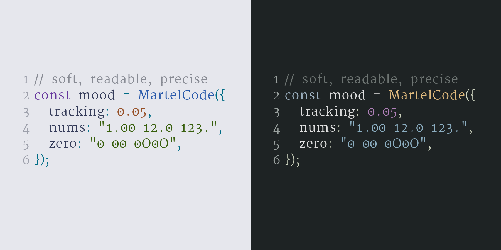

# Martel Code



A reproducible, programmatic derivation of the open-source [Martel](https://github.com/typeoff/martel) font for code/editor use.

Current transform goals:

- rename the family to **Martel Code**;
- normalize only selected main punctuation widths (`. , : ;` by default);
- make normal spaces substantially wider (`0.60em` minimum by default);
- add default tracking to Latin letters (`+0.05em` advance by default);
- add a centered dot to zero by default;
- make digits tabular and align `.` to the digit advance for decimal columns;
- render proof images;
- produce raw and gaussian-blur diff reports;
- scan selected kerning/pair rhythm issues with a gaussian-blur density test.

## Why metric transforms instead of OpenType “default letter spacing”?

OpenType does not provide a universal default tracking mechanism honored by all applications. The robust derived-font approach is to change advances/sidebearings for the intended glyph set. This repo does that for Latin letters, while leaving numerals to the tabular-width pass and complex-script shaping alone.

## Quick start

```sh
cd martel-code
make setup
make fetch
make build
make metrics
make proofs
make blur-qa
make kerning-scan
make calibrate
make release-fonts
make cover
```

Installable and web fonts are committed under:

- `fonts/ttf/MartelCode-Regular.ttf`
- `fonts/ttf/MartelCode-DemiBold.ttf`
- `fonts/ttf/MartelCode-Bold.ttf`
- `fonts/otf/MartelCode-Regular.otf`
- `fonts/otf/MartelCode-DemiBold.otf`
- `fonts/otf/MartelCode-Bold.otf`
- `fonts/woff2/MartelCode-Regular.woff2`
- `fonts/woff2/MartelCode-DemiBold.woff2`
- `fonts/woff2/MartelCode-Bold.woff2`

The `.otf` exports are OpenType sfnt fonts with TrueType outlines; the `.woff2` exports are the recommended web files.

Generated build artifacts are ignored by git:

- `build/fonts/MartelCode-Regular.ttf`
- `build/fonts/MartelCode-DemiBold.ttf`
- `build/fonts/MartelCode-Bold.ttf`
- `build/proofs/*.png`
- `build/reports/*.json`
- `build/reports/blur-code/*.png`
- `build/reports/kerning/kerning-blur-scan.csv`
- `build/calibration/summary.csv`
- `build/calibration/contact-sheet.png`
Committed documentation artifact:

- `assets/martel-code-cover.png`

Release archives generated by `make release-fonts`:

- `dist/martel-code-fonts.zip`
- `dist/martel-code-ttf.zip`
- `dist/martel-code-otf.zip`
- `dist/martel-code-woff2.zip`

## Configuration

Edit `config/martel-code.json` for the default build. Edit `config/calibration.json` for matrix exploration.

Important knobs:

```json
{
  "spacing": {
    "tracking_em": 0.05,
    "space_width_em": 0.60
  },
  "punctuation": {
    "normalized_width_em": 0.42,
    "glyphs": ["period", "comma", "colon", "semicolon"]
  },
  "zero": {
    "dot": true,
    "dot_diameter_em": 0.12
  },
  "numerals": {
    "tabular": true,
    "width_em": 0.62,
    "width_source": "0",
    "chars": "0123456789",
    "align_period": true
  }
}
```

`space_width_em` is treated as a minimum, so already-wider space glyphs are not accidentally narrowed.

The punctuation allowlist is deliberately small so we do not accidentally “normalize all punctuation.” Add glyphs only when you want that behavior.

## Cover image

`make cover` renders `assets/martel-code-cover.png` from the committed local palette snapshot at `config/cover-palettes.json` and the committed Regular font at `fonts/ttf/MartelCode-Regular.ttf`.

The cover generator is self-contained by default. It also has explicit `--slime-theme` and `--tokyo-light-theme` CLI overrides for maintainers who want to refresh the local palette snapshot from external VS Code theme files, but the published repo does not depend on those files.

## Calibration matrix

`make calibrate` runs a manifest-driven Regular-weight matrix from `config/calibration.json`:

- builds each candidate into `build/calibration/<candidate-id>/fonts/`;
- renders the fixed proof text;
- compares each candidate against upstream with raw + gaussian-blur diffs;
- runs the kerning/pair density scan;
- writes `summary.json`, `summary.csv`, and `contact-sheet.png`.

Candidate ids encode the parameters, e.g. `t005_s060_p042` means tracking `0.05em`, space minimum `0.60em`, punctuation width `0.42em`.

## Gaussian blur QA

`blur_qa.py` compares before/after proof renders at multiple blur radii. Raw diffs show contour-level changes; blurred diffs show text-color/rhythm shifts.

`kerning_blur_scan.py` renders selected pairs, blurs them, then measures ink density near the pair boundary. In the CSV:

- negative `z_score` = unusually open/light pair boundary;
- positive `z_score` = unusually tight/dark pair boundary.

This is a triage tool, not an automatic proof of correctness. Use it to find pairs worth looking at manually.

## Upstream and license

The fetched upstream TTFs come from `google/fonts/ofl/martel` at the pinned commit in `config/martel-code.json`. Martel is licensed under the SIL Open Font License 1.1. See `sources/upstream/OFL.txt` after `make fetch`.

Because this is a modified version, the family is renamed to **Martel Code**.
